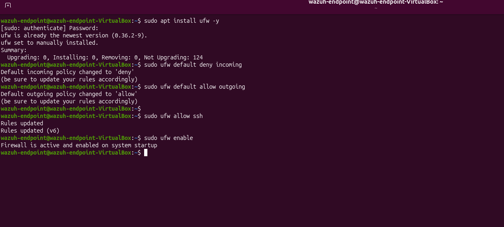

# 🛡️ Home SOC Lab: Attack Detection & Defense with Wazuh

## 📌 Overview

This project demonstrates the design and implementation of a home Security Operations Center (SOC) lab using Wazuh to simulate, detect, and mitigate real-world cyber attacks.

The lab replicates a basic enterprise security workflow:

- Attack simulation
- Log collection
- Threat detection
- Defensive mitigation

---

## 🧠 Objectives

- Build a working SIEM environment
- Simulate attacker behavior using Kali Linux
- Detect malicious activity through Wazuh logs
- Implement security controls to mitigate attacks
- Validate detection and defense effectiveness

---

## 🏗️ Lab Architecture

```text
Kali Linux (Attacker)  →  Endpoint (Wazuh Agent)  →  Wazuh Server (SIEM)
```

### Components

| Component | Purpose |
|---|---|
| Kali Linux | Attacker machine used for scanning and brute-force simulation |
| Linux Endpoint | Target system monitored by the Wazuh agent |
| Wazuh Server | SIEM used for alerting, log analysis, and threat hunting |

---

## ⚙️ Tools Used

- Wazuh
- Kali Linux
- Hydra
- Nmap
- OpenSSH Server
- UFW Firewall
- Linux command line

---

## ⚔️ Attack Simulation

### Port Scanning

Nmap was used to verify that SSH was open on the target endpoint.

```bash
nmap -p 22 <target-ip>
```

**Purpose:** Confirm that the target endpoint had an exposed SSH service.

---

### SSH Brute-Force Simulation

Hydra was used to simulate repeated SSH login attempts.

```bash
hydra -t 4 -l root -P test.txt ssh://<target-ip>
```

**Command breakdown:**

| Option | Meaning |
|---|---|
| `hydra` | Brute-force login testing tool |
| `-t 4` | Uses 4 parallel tasks |
| `-l root` | Attempts login with the username `root` |
| `-P test.txt` | Uses a password list from `test.txt` |
| `ssh://<target-ip>` | Targets the SSH service on the endpoint |

**Purpose:** Generate failed login attempts that Wazuh can detect.

---

## 🔎 Detection with Wazuh

Wazuh collected authentication logs from the endpoint and generated alerts for suspicious SSH activity.

### Threat Hunting Searches

```text
sshd
```

```text
authentication_failed
```

### Indicators Observed

- Multiple failed SSH login attempts
- Repeated authentication failures
- Source IP address of the Kali attacker machine
- Wazuh alert rule descriptions
- Endpoint agent reporting security events

---

## 🛡️ Defense Implementation

UFW was configured on the endpoint to reduce brute-force effectiveness.

```bash
sudo ufw default deny incoming
sudo ufw allow ssh
sudo ufw limit ssh
sudo ufw enable
```

### What the firewall rules do

| Command | Purpose |
|---|---|
| `sudo ufw default deny incoming` | Blocks inbound connections by default |
| `sudo ufw allow ssh` | Allows SSH access |
| `sudo ufw limit ssh` | Rate-limits repeated SSH attempts |
| `sudo ufw enable` | Enables the firewall |

---

## 📊 Results

### Before Firewall

- Hydra could generate repeated SSH login attempts
- Wazuh detected multiple authentication failures
- Brute-force activity was visible in security logs

### After Firewall

- SSH brute-force attempts were reduced or limited
- Hydra experienced connection issues/timeouts
- Attack effectiveness decreased after applying firewall controls

---

## 📸 Screenshots

Add screenshots to the `screenshots/` folder and embed them here.

Recommended screenshots:

1. Wazuh dashboard overview
2. Agent connected successfully
3. Nmap scan showing SSH open
4. Hydra attack running from Kali
5. Wazuh logs showing failed SSH authentication
6. UFW firewall status
7. Hydra timeout or reduced attack result after firewall

Example markdown:

```markdown

```

---

## 🧪 Key Skills Demonstrated

- SIEM configuration and monitoring
- Threat detection and log analysis
- Brute-force attack simulation
- Network security fundamentals
- Firewall configuration
- Security incident investigation
- SOC workflow documentation

---

## 🧠 Lessons Learned

- Detection alone is not enough; defensive controls are also needed
- Brute-force attacks are noisy and highly visible in authentication logs
- Endpoint logging is critical for threat visibility
- Simple firewall controls can reduce attacker effectiveness
- A SIEM helps centralize and investigate endpoint security events

---

## 🚀 Future Improvements

- Add Fail2Ban for automated brute-force blocking
- Add a Windows endpoint to expand monitoring coverage
- Create custom Wazuh detection rules
- Add dashboards for failed login trends
- Simulate additional attacks such as privilege escalation and persistence

---

## 📎 Author

**David Daberkoe**  
Cybersecurity / IT Student

---

## ⭐ Summary

This project demonstrates a complete SOC workflow:

```text
Simulate attack → Detect activity → Analyze logs → Implement defense → Validate results
```
